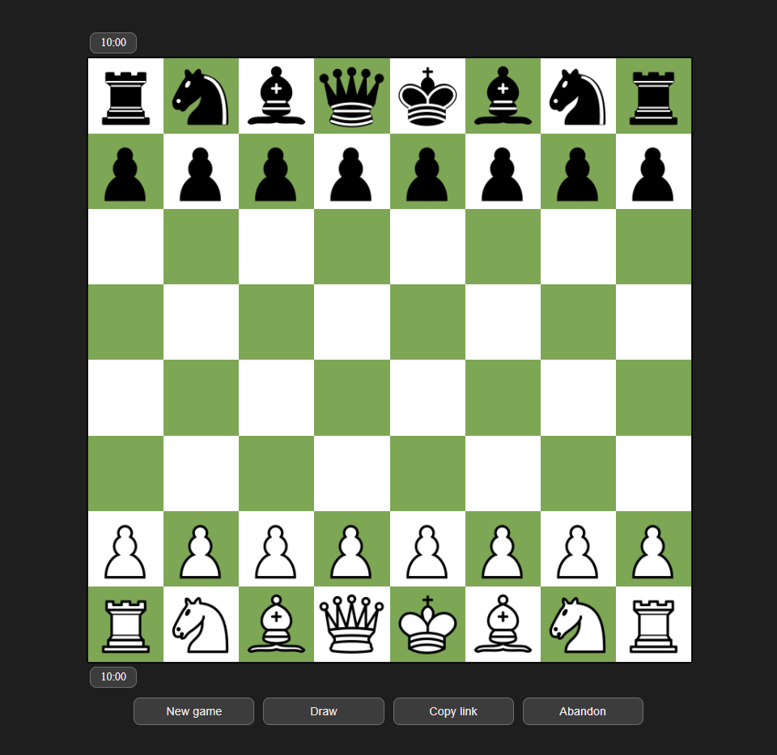

# Chess

The main goal of this project is to develop a Chess game engine in Vanilla JavaScript in order to learn and practice how to manage DOM events, objects and WebSockets communications.

The backend is developed in Golang, with [Echo](https://github.com/labstack/echo). The "why" behind of using Golang as programming language for backend is to learn the language itself as well as its well-known and powerful features such as Goroutines.

  

## Front-End (Vanilla JavaScript, HTML, CSS)
Here we can find the following classes:

<ul>
  <li> <!-- PIECE CLASS -->
    
      
      <strong>Piece</strong>: this represents both a piece in the board. It is represented by a type (pawn, bishop, knight...), file (A-Z) and rank (1-8), and color (black or white). Additionally, it contains an array where all its legal moves will be stored for each turn. This class is mainly used as a data container without any behaviour.
    

  </li>

  <li> <!-- BOARD CLASS -->
    

      <strong>Board</strong>: as its name says, it represents the game board. Its properties are an array with all white pieces, an array with all black pieces and an array      representing the squares.
    
    
    

      Internally, the board is represented with 120 squares instead of 64 (8 files by 8 ranks). Each of these squares is an integer indicating the type of piece that is on it or indicating that that cell is empty or out of the board. All these additional <i>out of board</i> squares are used to simplify and optimize the legal move calculations.
    

    

      This class also provides a set of methods to access easily the piece and its type located on a given cell or set a game from a [Forsyth–Edwards Notation (FEN) string](https://en.wikipedia.org/wiki/Forsyth%E2%80%93Edwards_Notation).
    

  </li>

  <li> <!-- TIMER CLASS -->
    

      <strong>Timer</strong>: provides an abstraction for managing timers and displaying them around the board. Its behaviours are changing the colour and numbers of the timer that it refers to from the DOM.
    

  </li>

  <li>
    
 <!-- MESSAGE CLASS -->
      <strong>MessageWS</strong>: represents the message that must be sent through WebSockets to the backend everytime a relevant action occurs (movement of a piece, abandonment, draw offer, etc.). A message is made of three properties:
    

    <ul>
      <li>
        

          <i>idxSrc</i>: when a movement is made, this value is a integer representing an index in the array of 120 squares of Board. The index is the piece that is being moved.
        

      </li>
      <li>
        

          <i>idxDst</i>: similarly, *idxDst* represents the index of the square where the piece is being positioned.
        

      </li>
      <li>
        

          <i>flag</i>: indicates via an integer whether an special event has occured such as checkmate, a player A send a draw offer to a player B, a player declines/accepts a draw offer, etc.
        

      </li>
    </ul>
  </li>

  <li> <!-- GAME CLASS -->
    

      <strong>Game</strong>: this is the game manager. It is in charge of initializing the board, calculating legal moves for all pieces after every move, managing the WebSockets communication with the backend by receiving, interpreting and sending MessageWS messages. Moreover, game rises events (show a modal, play sound...) whenever is necessary (draw offer, checkmate, timeout, etc.).
    

    

      Game contains a large set of properties that are used to control the different events and situations that may happen during a game such as (check flags, color that must play...) and references to objects that manipulate the DOM (white timer, black timer...)
    

  </li>
</ul>
