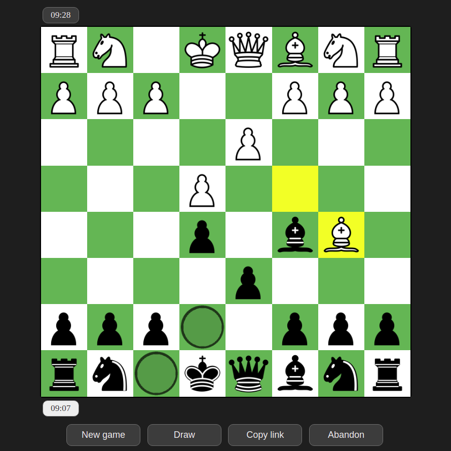
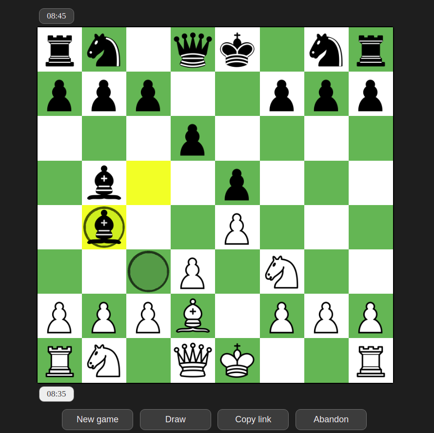
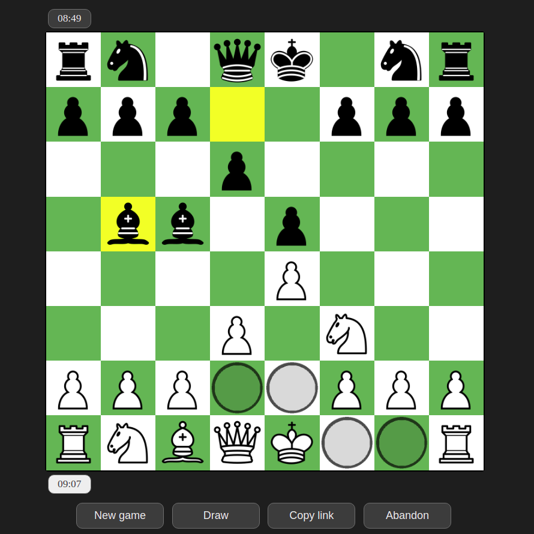
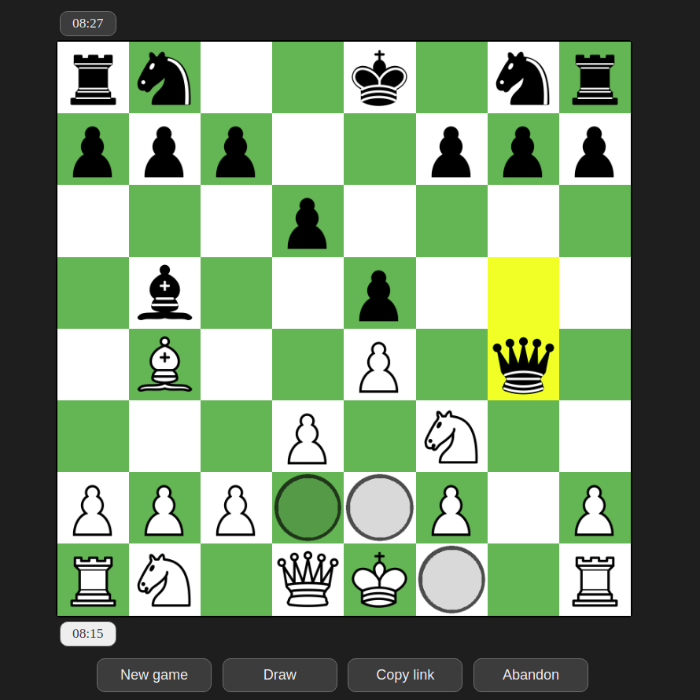
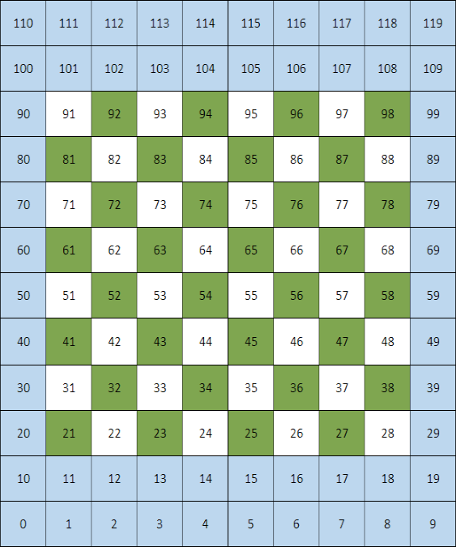

# Chess

<!-- PLAY CHESS -->
## Play chess
Do you want to play? You can find it <a href="https://go-chess.herokuapp.com/">here</a>. It is totally free and no login is required.
This chess not only allows players to play with official chess rules but also visualize legal moves of a selected piece, the last movement made and many other functionalities such as movement sound, game beginning sound and draw offer/declination/acceptance.

## Description
The main goal of this project is to develop a Chess game engine in Vanilla JavaScript in order to learn and practice how to manage DOM events, objects and WebSockets communications.

The backend is developed in Golang, with [EchoV4](https://github.com/labstack/echo). The "why" behind of using Golang as programming language for backend is to learn the language itself as well as its well-known and powerful features such as Goroutines.

## Technologies summary
<ul>
  <li>
    <p>
      <strong>Frontend</strong>: Vanilla JavaScript, Object-oriented programming, <a href="https://developer.mozilla.org/es/docs/Web/API/WebSocket">WebSockets</a>, HTML, CSS
    </p>
  </li>  
  <li>
    <p>
      <strong>Backend</strong>: <a href="https://golang.org/">Golang1.17</a>, Object-oriented programming, <a href="https://gobyexample.com/goroutines">Goroutines</a>, <a href="https://gobyexample.com/channels">Channels</a>, <a href="https://pkg.go.dev/golang.org/x/net/websocket">x/net/websockets</a>, <a href="https://github.com/labstack/echo">EchoV4</a>, <a href="https://pkg.go.dev/sync#RWMutex">sync.RWMutex</a>.
    </p>
  </li>
</ul>

<!-- FRONTEND -->
## Frontend
<p align="center"> <!-- CHECK -->
    
  <p align="center">
    White bishop in B5 checks black king in E8 and black king can only move to E7 and F8.
  </p>
</p>
<br>
<p align="center"> <!-- CHECK BLOCK -->
    
  <p align="center">
    White bishop in D2 is blocking check from black bishop in B4, so the white bishop can only move in the same diagonal where both bishops are.
  </p>
</p>
<br>
<p align="center"> <!-- CASTLE -->
    
  <p align="center">
    White king can castle with H1 rook.
  </p>
</p>
<br>
<p align="center"> <!-- CANT CASTLE -->
    
  <p align="center">
    White king can not castle with H1 rook because the black queen in G4 is attacking G1.
  </p>
</p>

Here we can find the following classes:

<ul>
  <li> <!-- PIECE CLASS -->
    <p>
      <strong>Piece</strong>: this represents a piece in the board. It has a type (pawn, bishop, knight...), file (A-Z), rank (1-8), and color (black or white). Additionally, it contains an array where all its legal moves will be stored for each turn. This class is mainly used as a data container without any behaviour.
    </p>
  </li>

  <li> <!-- BOARD CLASS -->
    <p>
      <strong>Board</strong>: as its name says, it represents the game board. Its properties are an array with all white pieces, an array with all black pieces and an array      representing the squares.
    </p>
    <p>
      Internally, the board is represented with 120 squares instead of 64 (8 files by 8 ranks). Each of these squares is an integer indicating the type of piece that is on it or indicating that that cell is empty or out of the board. All these additional <i>out of board</i> squares (1 file before the A file, 1 file after the H file, 2 ranks before 1st rank and 2 ranks after the 8th rank) are used to simplify and optimize the legal move calculations.             
    </p>    
    <p>
      This class also provides a set of methods to access easily the piece located on a given cell or set a board position from a <a href="https://en.wikipedia.org/wiki/Forsyth%E2%80%93Edwards_Notation">Forsyth–Edwards Notation (FEN) string</a>.
    </p>
    <div align="center">
        
    </div
  </li>

  <li> <!-- TIMER CLASS -->
    <p>
      <strong>Timer</strong>: provides an abstraction for managing timers and displaying them around the board. Its behaviours are changing the colour and numbers of the timer that it refers to from the DOM.
    </p>
  </li>

  <li>
    <p> <!-- MESSAGEWS CLASS -->
      <strong>MessageWS</strong>: represents the message that must be sent through WebSockets to the backend everytime a relevant action occurs (movement of a piece, abandonment, draw offer, etc.). A message is made of three properties:
    </p>
    <ul>
      <li>
        <p>
          <i>idxSrc</i>: when a movement is made, this value is a integer representing an index in the array of 120 squares of Board. The index refers to the piece that is being moved.
        </p>
      </li>
      <li>
        <p>
          <i>idxDst</i>: similarly, <i>idxDst</i> represents the index of the square where the piece is being positioned.
        </p>
      </li>
      <li>
        <p>
          <i>flag</i>: indicates via an integer whether an special event has occured such as checkmate, a player A send a draw offer to a player B, a player declines/accepts a draw offer, etc.
        </p>
      </li>
    </ul>
  </li>

  <li> <!-- GAME CLASS -->
    <p>
      <strong>Game</strong>: this is the game manager. It is in charge of initializing the board, calculating legal moves (which is unquestionably the most difficult part of this project because of all the exceptions and possibilities that may happen and have to be controlled) for all pieces after every move, managing the WebSockets communication with the backend by receiving, interpreting and sending MessageWS messages. Moreover, game rises events (show a modal, play sound...) whenever is necessary (draw offer, checkmate, timeout, etc.).
    </p>
    <p>
      Game contains a large set of properties that are used to control the different events and situations that may happen during a game such as (check flags, color that must play...) and references to objects that manipulate the DOM (white timer, black timer...)
    </p>
  </li>
</ul>

<!-- BACKEND -->
## Backend
On this side, we find the following types:

<ul>
  <li> <!-- MESSAGEWS TYPE -->
    <p>
      <strong>MessageWS</strong>: this is the equivalent to the <i>MessageWS</i> that we saw in Frontend.
    </p>
  </li>
  <li> <!-- CHESSTIMER TYPE -->
    <p>
      <strong>ChessTimer</strong>: as its name says, this is the type used to represent game timers. Internally it has a <a href="https://pkg.go.dev/time#Time">time.Time</a> instance that is used to calculate and store the remaining time as well as a <a href="https://pkg.go.dev/sync#RWMutex">sync.RWMutex</a> to control the access both for modifications and readings of the clock. Besides, it has a flag indicating if the timer is running or stopped and a <a href="https://pkg.go.dev/time#Duration">time.Duration</a> that is used to indicate the time elapsed between each timer update.
    </p>
  </li>
  <li> <!-- PLAYER TYPE -->
    <p>
      <strong>Player</strong>: represents the players of a game and has color, a channel for messages, a pointer to the <a href="https://pkg.go.dev/golang.org/x/net/websocket">WebSocket</a> connnection that links the backend to the client, a channel used to send/receive the "quit" signal to the main Goroutine associated to the player (the one in charge of keeping the WebSocket alive as well as other tasks) and a pointer to its <i>Chess Timer</i>.
    </p>
    <p>
      Once a game has started, each player has 3 Goroutines associated, the one described in the previous paragraph, one for receiving messages from its client and other for sending messages to its client. When a playerA receives a message from its client, it will redirect that message to the Send Goroutine associated to the playerB through playerB channel for messages and then playerB will send it to its client.
    </p>
    <p>
      If a player receives a flag in the message indicating the end of the game (e.g. checkmate, draw, etc...), the quit channel will be filled and then all the Goroutines associated to this player will be finished.
    </p>
    <p>
      Otherwise, if the received message indicates that a piece has been moved, then the player will stop its timer and will start its opponent's.
    </p>
  </li>
  <li> <!-- GAME TYPE -->
    <p>
      <strong>Game</strong>: represents a game and contains two pointers, one for each player and a quit channel. This is in charge of updating the timers as well as sending to both players the start signal once the second player joins the game through a share link.
    </p>
    <p>
      A game is created when a player send a request to the server of creating a new game. In this case, the server will generate a hashed token with <a href="https://en.wikipedia.org/wiki/MD5">MD5</a> and will make a share link with this token by appending it to the app URL. Once the share link is made, it is sent to the client who created the game and then two Goroutines will be created for this player waiting for messages and the beginning of its game.
    </p>
    <p>
      When a second player joins a game through a share link, the server will check that the given token still exists and in case it does, a signal to both clientes will be sent indicating the beginning of the game, a Goroutine will be created by Game to manage timers and two Goroutines will be created for this player similarly they were created for the player who created the game. Otherwise, a 404 error will be send to the client. 
    </p>
  </li>
  <li> <!-- GAMEMAP TYPE -->
    <p>
      <strong>GameMap</strong>: it is a collection where all games that are being played and those that are waiting for a second player to join are stored. This has two properties: a map with a string as key and a pointer of Game as value, and a <a href="https://pkg.go.dev/sync#RWMutex">sync.RWMutex</a> instance to manage concurrent access to the map. Moreover, three methods are provided by this type: addGame(key, value), removeGame(key), getGame(key)(game*, exists).
    </p>
  </li>
</ul>

<!-- HOW TO RUN -->
# How to run the project
First of all, you need to install <a href="https://golang.org/">Golang1.17</a> following the official documentation. Then, move to the root directory of this project and run:  
```bash
$ go get github.com/labstack/echo/v4
```
Then, if you are in a Windows machine:
```shell
C:\user> runserver.bat
```
If you are in a Linux machine:
```bash
foo@bar:~$ go run *
```
Once the server is up and running, open your browser and type ```localhost:8080``` and you will see the chess.

<!-- AUTHORS -->
# Authors
<ul>
  <li>
    <p>
      <b>Carlos Eduardo Arismendi Sánchez</b>:
        <ul>
          <li>
            LinkedIn: <a href="https://www.linkedin.com/in/carlos-arismendi/">https://www.linkedin.com/in/carlos-arismendi/</a>
          </li>
          <li>
            Email: <a href="mailto:carlos.arismendisanchez@gmail.com">carlos.arismendisanchez@gmail.com</a>
          </li>
        </ul>
    </p>
  </li>
  <li>
    <p>
      <b>Antón Chernysh</b>:
        <ul>
          <li>
            LinkedIn: <a href="https://www.linkedin.com/in/anton-chernysh/">https://www.linkedin.com/in/anton-chernysh/</a>
          </li>
          <li>
            Email: <a href="mailto:anton_chernysh@outlook.es">anton_chernysh@outlook.es</a>
          </li>
        </ul>
    </p>
  </li>
</ul>

